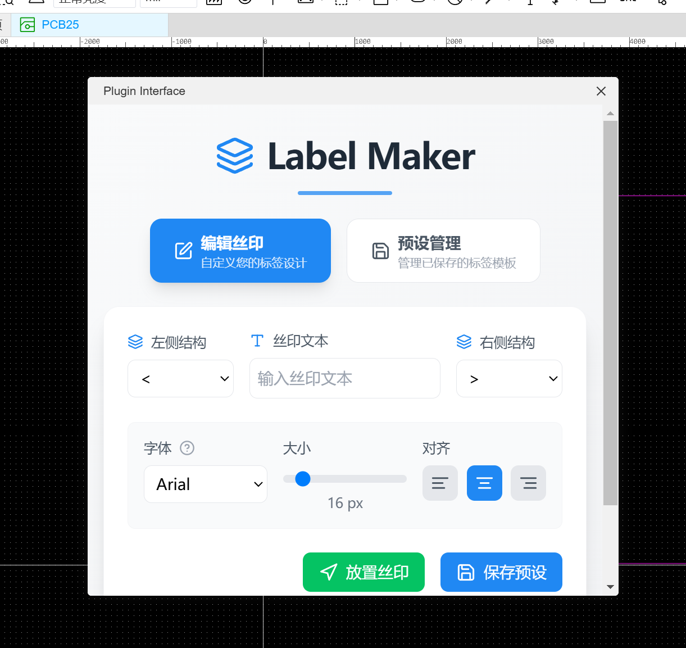
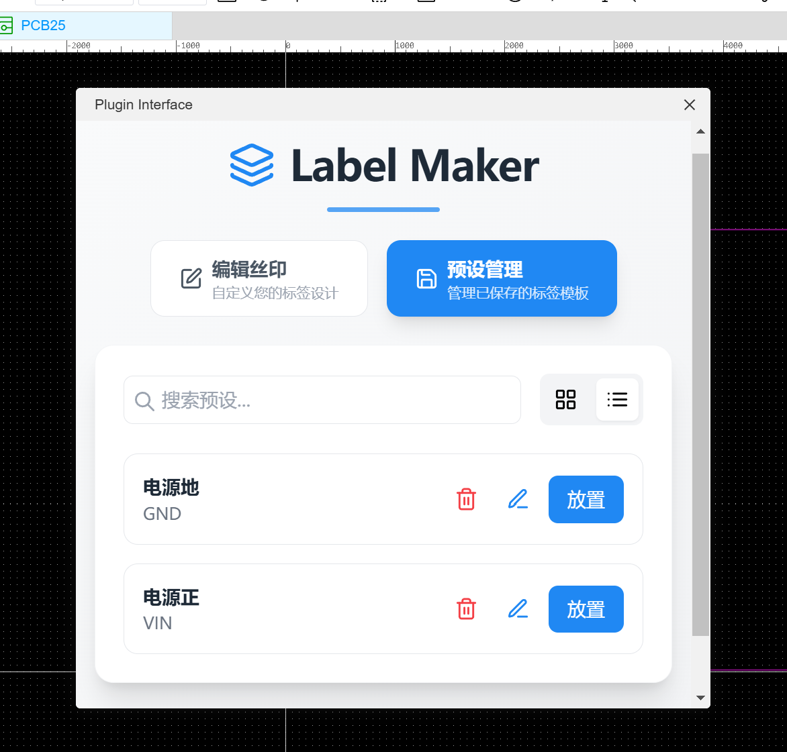

[简体中文](#) | [English](./docs/README.en.md) | [日本語](./docs/README.ja.md)

# LCEDA Pro LabelMaker

A silk screen editor plugin for [EasyEDA Pro](https://lceda.cn/), featuring modern React UI and seamless integration with the LCEDA SDK.

---

## 项目简介

**LCEDA-Pro-LabelMaker** 是为嘉立创EDA专业版设计的丝印生成插件，使用 React 技术栈，核心功能参考并改进了 [嘉立创EDA 标准版插件](https://github.com/xsrf/easyeda-labelmaker)。

---

## 功能亮点

-   🖥️ 现代化 UI：采用 React 构建，体验流畅，操作便捷
-   🔗 原生集成：基于 LCEDA 专业版 SDK ，无缝嵌入

---

## 安装方式

1. 访问 [Releases 页面](../../releases) 下载最新版插件 (`.eext` 文件)
2. 在 立创EDA 专业版 打开「插件管理」，加载下载的 `.eext` 文件

---

## 使用说明

-   打开 PCB 项目，在 顶栏 选择 LabelMaker
-   按需调整标签内容，完成设计后点击放置，丝印将应用到 PCB 页面

---

## 参考与致谢

本项目受 [嘉立创EDA 标准版插件](https://github.com/xsrf/easyeda-labelmaker) 启发，并在其基础上结合 React 框架进行了升级优化。  
感谢所有开源朋友和社区的技术交流与贡献！

---

## 开发与贡献

欢迎参与共建！如需提交 PR，请：

1. 请严格遵循 [Conventional Commits](https://www.conventionalcommits.org/zh-hans/v1.0.0/) 规范，使用标准的提交信息。例如：
    ```
    feat: 新增批量生成功能
    fix: 修复多选模式下的显示 bug
    ```
2. **不需要手动修改版本号或撰写 changelog**。CI/CD 会自动处理这些流程。
3. 所有提交和发布流程完全自动化，merge 后 CI 会检测、发布和生成更新日志。

---

## 协议声明

本扩展采用 [Apache License 2.0](https://choosealicense.com/licenses/apache-2.0/) 开源协议。  
“嘉立创EDA”、“EasyEDA” 等名称仅用于插件的功能描述和开源项目标题，相关商标归立创/嘉立创所有。

---

## 联系与支持

-   Issues 或建议请通过 [GitHub Issues](../../issues) 反馈
-   社区交流：见项目 Discussions 区



